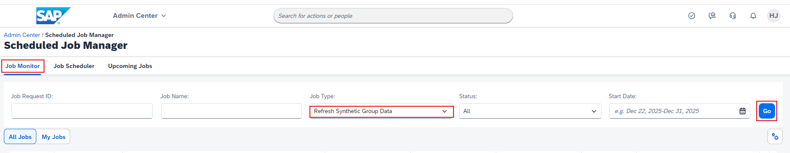
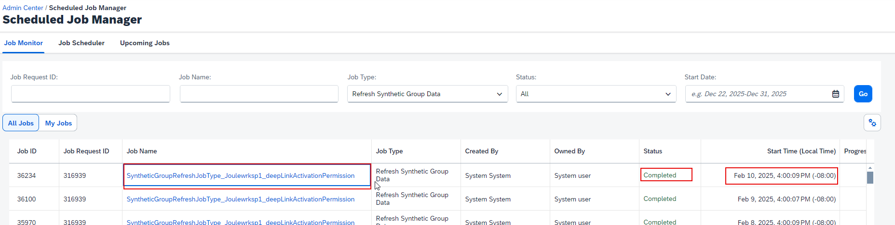
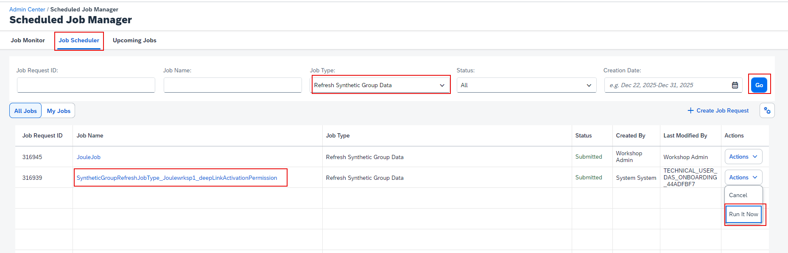

1. Login to SuccessFactors Application.
2. Navigate to **Admin Center**-> **Scheduled Job Manager**.
3. Under **Job Monitor**, set the **Job Type** filter to **Refresh Synthetic Group Data** and click **Go**. 

4. Confirm the **SyntheticGroupRefreshJobType_yourcompanyID_deepLinkActivationPermission** has executed successfully at least once in your system.

**Note**:  This job is created automatically in the SuccessFactors system by the Joule booster.
5. If the job doesn't show up under the Job Monitor, click the **Job Scheduler** tab. Set the **Job Type** filter to **Refresh Synthetic Group Data** and click **Go**.  Fom the **Actions** menu, click **Run it Now** to execute the **SyntheticGroupRefreshJobType_yourcompanyID_deepLinkActivationPermission** job.

6. Switch to **Job Monitor** tab and confirm the job executes successfully before proceeding to the next step in the mission.

**Note**: This job execution would make sure all the users who are assigned deep link specific access are refreshed and synced correctly during Identity Provisioning sync to SAP Build Work Zone application.  It's important that this job is executed at least once before proceeding with next steps to synch users in SAP Build Work Zone.
