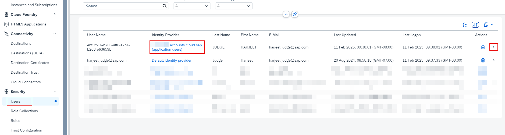
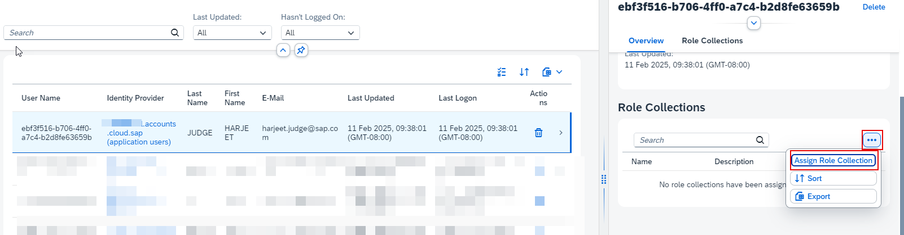
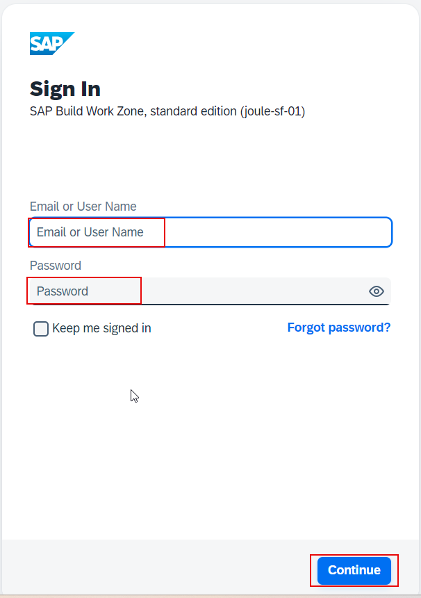

1. From the Navigation Pane on the left, select **Security >> Users** and click the arrow to open user details. 

 **NOTE**: Make sure to select SAP Cloud Identity User. User from Default Identity Provider should not be used. 

3. Scroll down to role collections section and click **Additional Details** icon >> **Assign Role Collections**.  
   

4. Select the **Launchpad_Admin** and click **Assign Role Collection**. 
 

5. From the Navigation Pane on the left, select **Instances and Subscriptions***. Click **SAP Build Work Zone, standard edition** to launch the application.   
 

6. Specify credentials of user who has Launchpad_Admin role and click **Continue**. 
 

7. Click **Channel Manager** icon.      
  

8. Click **+New**.           

9. Add a new content provider using the information below and click **Save**:
  * Title: <-- Title of your choice eg. **SFSF** -->
  * Design-Time Destination: <-- Design time destination created earlier eg. **LPS_SFSF_dt** -->
  * Runtime Destination: <-- Runtime destination created by the booster eg. **LPS_SFSF_rt** -->
  * Runtime Destination for Dynamic Data: **Use default runtime destination**                   
**Note**: Make a note of the **ID** that is generated automatically on this screen.  This ID is required when we setup the user provisioning job to SAP Build Work Zone in later steps.                          

9. Confirm the content provider is successfully created.                                        

