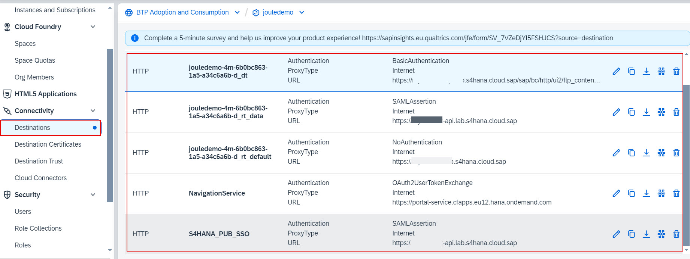
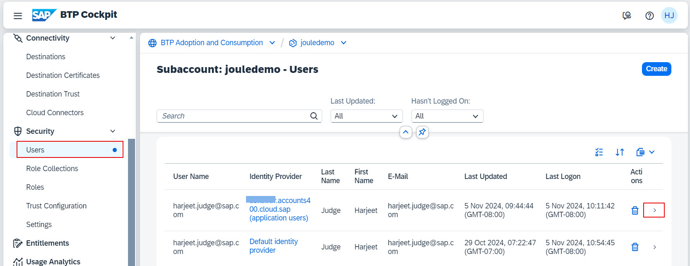
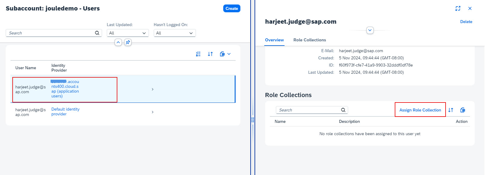
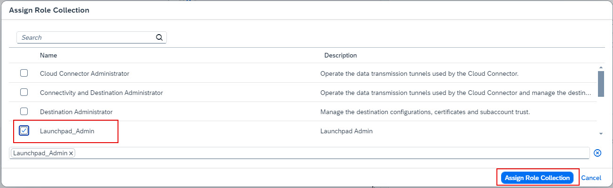
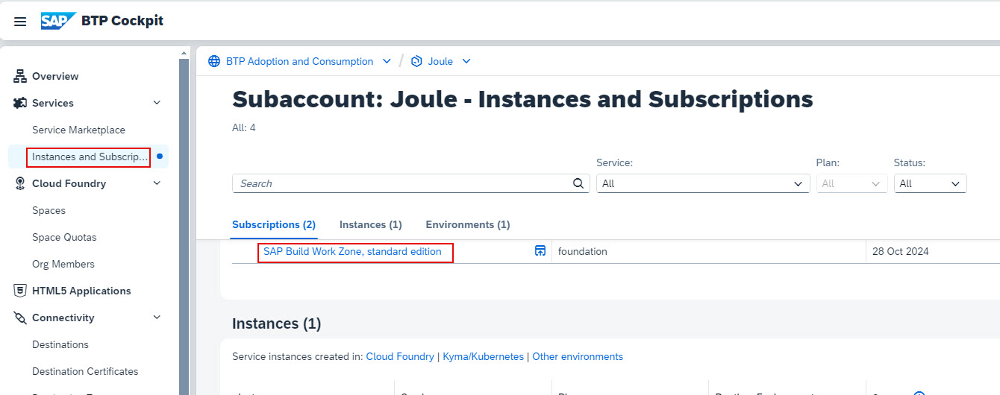
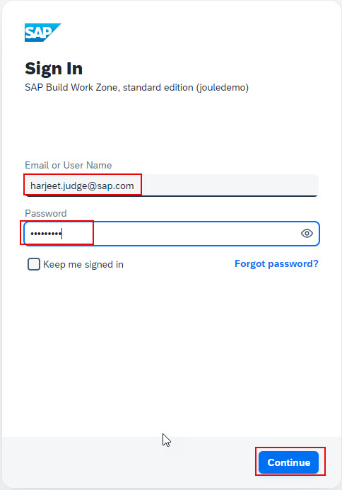
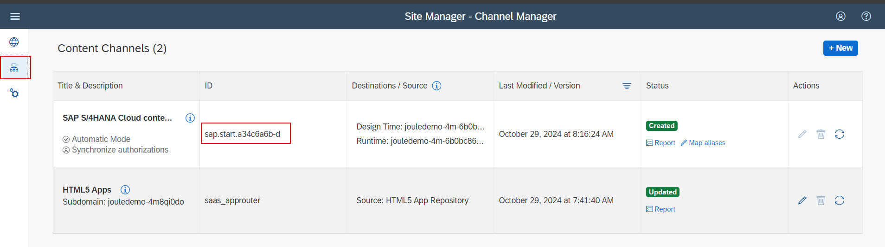

## Check SAP S/4HANA Cloud Public Edition Destinations setup in BTP Subaccount
1. Click **Connectivity -> Destinations** and confirm the destinations required for SAP S/4HANA Cloud Public Edition are successfully created in your BTP Subaccount.  The following 5 destinations should already exist in your BTP subaccount:
  * Designtime Destination - (with _dt in the name)
  * Runtime Destinations
    * Runtime Data (with _rt_data in the name)
    * Runtime Default (with _rt_default in the name)
  * S4HANA_PUB_SSO
  * NavigationService
    
**NOTE**: The Navigation Service is created manually after the Joule booster execution and the other 4 destinations are created automatically by the booster.  The names of the Designtime and Runtime destinations are auto generated by the booster and may not match the screenshot shown.  You may also see additional designtime and runtime destinations in the list if Joule booster was also executed for other SAP solutions besides SAP S/4HANA Cloud Public Edition.

## Check Content Provider in SAP Build Work Zone
**NOTE**: The Joule booster automatically creates a content provider for SAP S/4HANA Cloud Public Edition in SAP Build Work Zone using the Runtime and Designtime destinations mentioned above.
1. From the Navigation Pane in BTP Cockpit, select **Security >> Users** and click the arrow to open user details. 
**NOTE**: Make sure to select SAP Cloud Identity User.  User from Default Identity Provider should not be used. 

2. Click **Assign Role Collections**.  
   

3. Select the **Launchpad_Admin** and click **Assign Role Collection**. 
 

4. From the Navigation Pane on the left, select **Instances and Subscriptions***. Click **SAP Build Work Zone, standard edition** to launch the application.   
 

5. Specify credentials of user who has Launchpad_Admin role and click Continue. 
 

6. Click the **Channel Manager** icon and make a note of the **ID** of the SAP S/4HANA Cloud Public Edition Content Provider.  The ID will be required later in the SAP Cloud Identity Provisioning setup. 

